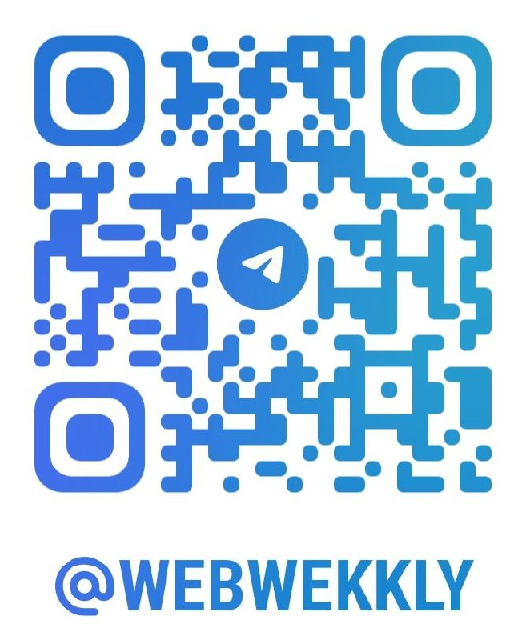

# Unlocking JavaScript's Hidden Gems

Hi everyone,
I hope you enjoyed the presentation. I'd like to thank everyone who attended for their time and attention.
If you'd like to learn more, all of the code samples and the presentation are available on this page.
Thanks again, and I hope to see you next time.

[Slide](./assets/reversim24Slide.pdf)

Yanai Edri

Telegram channel to be updated:

[{:height="65px" width="65px"}](https://t.me/webWekkly)

## Demo links

[speechRecognition](./speechRecognition/index.html) - In Hebrew:
למעלה / למטה / לך להתחלה / לך לסוף

[gamePadApi](./gamePadApi/index.html)

[vibration](./vibration/index.html)

[webXr - \<model-viewer\> element](./webXr/index.html)

## Links

[SpeechSynthesis](https://mdn.github.io/dom-examples/web-speech-api/speak-easy-synthesis/)

dcument-picture-in-picture-api [Link1](https://lazy-guy.github.io/tomodoro/index.html) [Link2](https://document-picture-in-picture-api.glitch.me/)

[Shape-detection-api demo](https://ckeditor.github.io/labs/shape-detection-api/)

[webOTP](https://jsfh2.csb.app/)

[Web Authentication API](https://webauthn.io/)

[WebGPU - samples](https://webgpu.github.io/webgpu-samples/samples/particles)

[\<model-viewer\>](https://modelviewer.dev/examples/augmentedreality/index.html)

[chrome status](https://chromestatus.com/features#shape)

#### Additional resources

[https://developer.mozilla.org/en-US/docs/Web/API](https://developer.mozilla.org/en-US/docs/Web/API)

[https://developer.chrome.com/](https://developer.chrome.com/)
